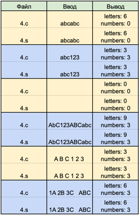
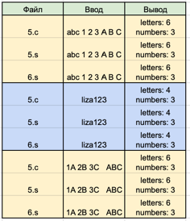
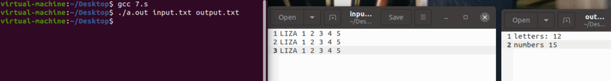
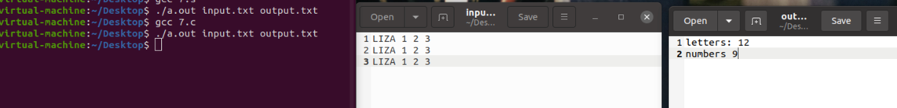
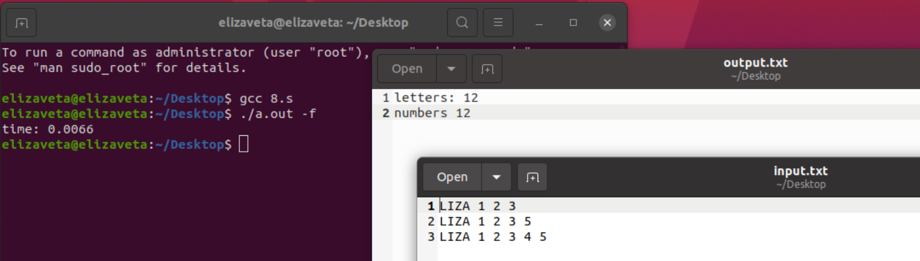
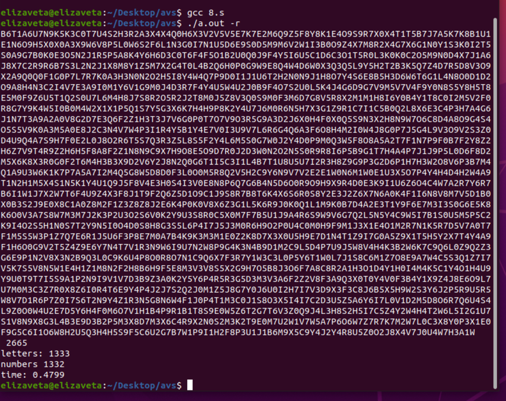
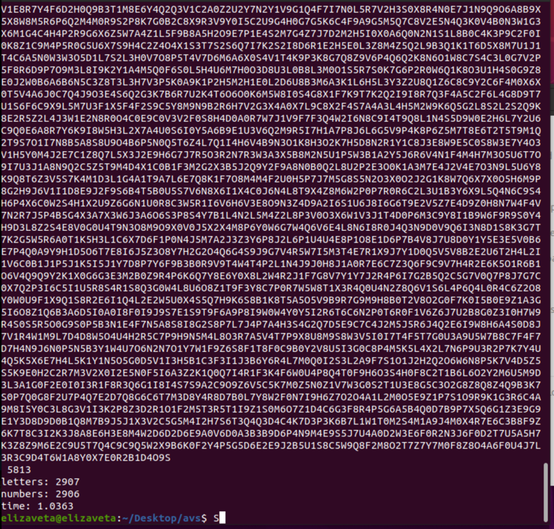
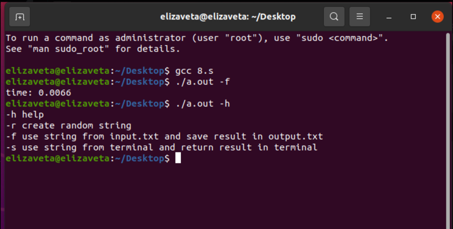

# HW_2
## Осипова Елизавета - БПИ219 - Вариант 16

### Задание - 16 вариант:
Разработать программу, которая вычисляет количество цифр и букв заданной ASCII-строке.


### На 4 балла:
Решение на 4 балла на C - [4.c](4.c) 
<br>Программа на ассемблере на 4 балла с убраными лишними макросами и соответстующими комментариями  - [4.s](4.s) </br>

```
#include <stdio.h>
#include <stdlib.h>

char *get(int *len, int *test) {
    *len = 0; 
    *test = 0;
    int cap = 1; 
    char *s = (char*) malloc(sizeof(char)); 
    char c = getchar();
    if(c > 127){
      (*test)++;
    }  
    while (c != '\n') {
        s[(*len)++] = c; 
        if (*len >= cap) {
            cap *= 2; 
            s = (char*) realloc(s, cap * sizeof(char)); 
        }

        c = getchar();
	if(c > 127){
          (*test)++;
        }          
    }
    s[*len] = '\0'; 
    return s; 
}

int main() {
    int len, test; 
    int l = 0;
    int n = 0;
    char *s = get(&len, &test);
    if(test == 0){
      for(int i = 0; i < len;i++){
        if(((s[i] >= 65) && (s[i] <= 90)) || ((s[i] >= 97) && (s[i] <= 122))){
          l++;
        }
        else if((s[i] >= 48) && (s[i] <= 57)){
          n++;
        }
      }
      printf("letters: %d \nnumbers %d\n", l, n);
      return 0; 
    }
    else{
      printf("incorrect input");
      return 0;
    }
    free(s); 
    return 0;
}
```

Тесты и результаты:
<br ></br>

### На 5 баллов:

Решение на 5 баллов на С - [5.c](5.c)
<br> Программа на ассемблере на 5 баллов с соответстующими комментариями  - [5.s](5.s) </br>

char *get(int *len, int *test) - на вход подается длина строки и переменная для проверки правильности ввода.

<br>void l_n(char *s, int len, int *l, int *n) -  на вход подается указатель на строку, длина строки, l - количество букв, n - количество цифр.</br>

```
#include <stdio.h>
#include <stdlib.h>

char *get(int *len, int *test) {
    *len = 0; 
    *test = 0;
    int cap = 1; 
    char *s = (char*) malloc(sizeof(char)); 
    char c = getchar();
    if(c > 127){
      (*test)++;
    }  
    while (c != '\n') {
        s[(*len)++] = c; 
        if (*len >= cap) {
            cap *= 2; 
            s = (char*) realloc(s, cap * sizeof(char)); 
        }

        c = getchar();
	if(c > 127){
          (*test)++;
        }          
    }
    s[*len] = '\0'; 
    return s; 
}
void l_n(char *s, int len, int *l, int *n){
    for(int i = 0; i < len;i++){
        if(((s[i] >= 65) && (s[i] <= 90)) || ((s[i] >= 97) && (s[i] <= 122))){
          (*l)++;
        }
        else if((s[i] >= 48) && (s[i] <= 57)){
          (*n)++;
        }
      }
}

int main() {
    int len, test; 
    int l = 0;
    int n = 0;
    char *s = get(&len, &test);
    if(test == 0){
      l_n(s, len, &l, &n);
      printf("letters: %d \nnumbers %d\n", l, n);
      return 0; 
    }
    else{
      printf("incorrect input");
      return 0;
    }
    free(s); 
    return 0;
}
```

### На 6 баллов:
Код программы был разделён на два файла, один из которых содержит основную программу - [6-1.s](6-1.s), а второй - функции - [6-2.s](6-2.s). 

[6.s](6.s) - программа с соответствующими комментариями, полученная в результате рефакторинга 5.s.

Представлено полное тестовое покрытие, дающее одинаковый результат на обоих программах.
<br>Приведены результаты тестовых прогонов для всех трех программ, демонстрирующие эквивалентность функционирования.</br>



### На 7 баллов:

Решение на 7 баллов на С - [7.c](7.c)
<br>Программа на ассемблере на 7 баллов с соответстующими комментариями  - [7.s](7.s) </br>

Реализация программы на ассемблере, полученной после рефакторинга, в виде двух единиц компиляции:
[6-1.s](6-1.s) - первая часть компиляции. <br>
[6-2.s](6-2.s) - вторая часть компиляции.

В программу добавлены ввод данных из файла и вывод результатов в файл:
[input.txt](input.txt) - файл с входными данными
[output.txt](output.txt) - файл с выходными данными

Тесты и результаты:
<br></br>
<br></br>

### На 8 баллов:

Решение на 8 баллов на С после рефакторинга, для проведения сравнения на производительность - [8.c](8.c) 
Добавлены замеры во времени, которые не учитывают время ввода и вывода данных. 



```
printf("time: %.4lf\n", (double)(end-start)/(CLOCKS_PER_SEC));
```

На рандомных числах:

Пример 1:
<br>

Пример 2:
<br>




ключ -h help (вывод всех ключей с обозначениями)

ключ -f input.txt output.txt (ввод из входного файла и запись результата в выходной файл)

ключ -r N (где N размер рандомной строки, генерируется рандомная строка размером N)

ключ -s (ввод из командной строки)

### На 9 баллов:
Размер .s файла полученного после компиляции с помощью флагов состовляет 239 строк, в то время когда с оптимизацией 183 строки.
Программа после рефакторинга работает быстрее. 


